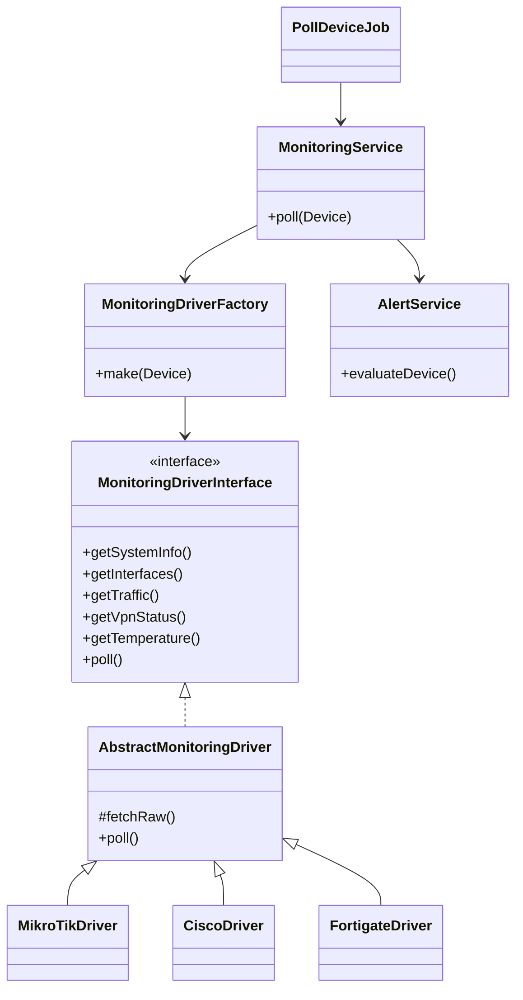
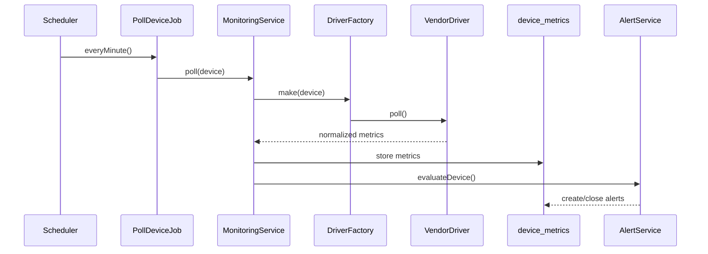

# Anvica NMS — Monitoring Architecture

## Overview

Enterprise monitoring stack using **Strategy Pattern** for vendor drivers, **Repository Pattern** for data access, and **Queue Jobs** for scheduled polling.

## Folder Structure

```
app/
├── Http/
│   ├── Controllers/
│   │   ├── AlertController.php
│   │   ├── DeviceController.php
│   │   ├── DeviceVendorController.php
│   │   ├── ServiceController.php
│   │   ├── ServicePointController.php
│   │   └── Api/MonitoringApiController.php
│   └── Requests/
│       ├── StoreDeviceRequest.php
│       └── UpdateDeviceRequest.php
├── Jobs/
│   ├── PollDeviceJob.php
│   ├── PollRouterJob.php
│   ├── PollSwitchJob.php
│   └── PollFirewallJob.php
├── Monitoring/
│   ├── Contracts/MonitoringDriverInterface.php
│   ├── Drivers/
│   │   ├── AbstractMonitoringDriver.php
│   │   ├── MikroTikDriver.php
│   │   ├── CiscoDriver.php
│   │   ├── FortigateDriver.php
│   │   ├── WindowsServerDriver.php
│   │   ├── LinuxServerDriver.php
│   │   └── GenericDriver.php
│   ├── Normalizers/MetricNormalizer.php
│   └── MonitoringDriverFactory.php
├── Repositories/
│   ├── AlertRepository.php
│   ├── DeviceRepository.php
│   ├── DeviceVendorRepository.php
│   └── ServiceRepository.php
└── Services/
    ├── AlertService.php
    └── MonitoringService.php
```

## UML — Class Diagram



## UML — Polling Sequence



## Data Normalization

All vendor drivers return a common structure via `MetricNormalizer`:

```php
[
    'hostname' => 'Anvica Demo',
    'cpu' => 12,
    'ram_used' => 2700804096,
    'ram_total' => 8589934592,
    'ram' => 31.5,
    'disk_used' => 381620224,
    'disk_total' => 1073741824,
    'disk' => 35.5,
    'uptime' => '6d22:04:21',
    'temperature' => 42,
]
```

## Alert Rules

| Metric | Warning | Critical |
|--------|---------|----------|
| CPU | > 80% | > 95% |
| RAM | > 90% | > 95% |
| Disk | > 90% | > 95% |
| Temperature | > 70°C | > 85°C |
| Device | Offline | — |

## Scheduler

Configured in `routes/console.php`:

- `PollRouterJob` — every minute
- `PollSwitchJob` — every minute
- `PollFirewallJob` — every minute
- `PollDeviceJob` — all other service types, every minute

Run scheduler: `php artisan schedule:work`

Run queue worker: `php artisan queue:work`

## API Endpoints

| Method | URI | Description |
|--------|-----|-------------|
| GET | `/api/monitoring/dashboard` | Summary counts |
| GET | `/api/monitoring/devices/{id}/metrics` | Latest metrics |
| GET | `/api/monitoring/devices/{id}/health` | Health score |

## Database Tables

- `services` — device types (Router, Switch, …)
- `service_points` — monitoring metrics per service
- `device_vendors` — vendors per service
- `devices` — monitored devices (links customer/user, service, vendor)
- `device_metrics` — polled metric values
- `device_interfaces` — interface traffic
- `alerts` — alert engine output
